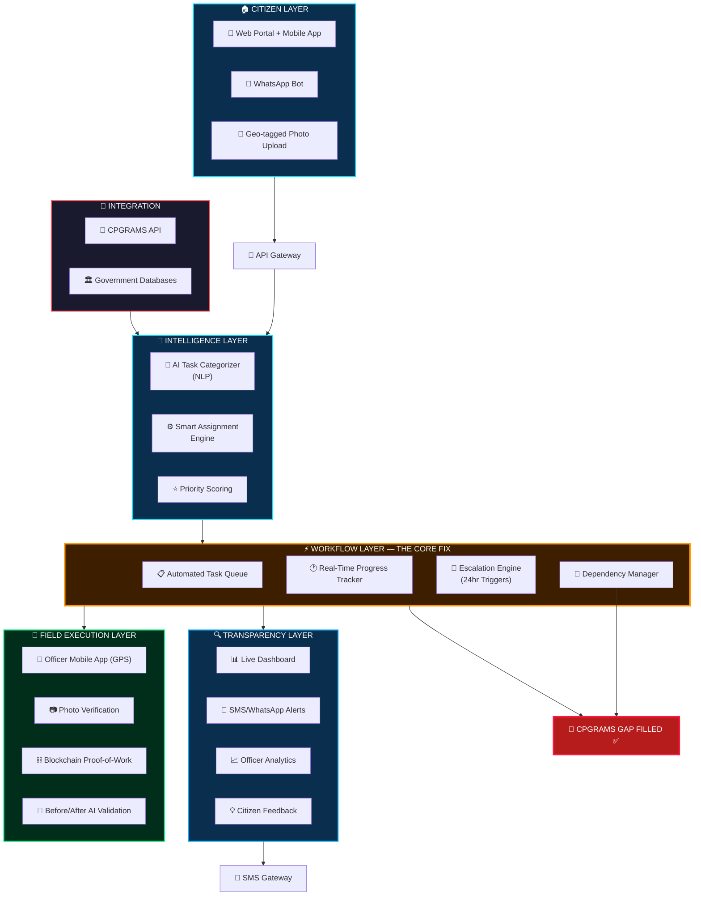

<div align="center">

# 🏛️ CENTRALIZED INFORMATION PLATFORM (CivicPulse)

### **End-to-End Automated Grievance Redressal & Civic Management System**

[](https://github.com/25f3001314-dev/CENTRALIZED-INFORMATION-PLATFORM/blob/main/LICENSE)
[](#tech-stack)
[](#overview)

*Empowering citizens through technology-driven transparency, accountability, and smart governance.*

</div>

---

## 📖 Overview

**CivicPulse** is a Centralized Information Platform designed to revolutionize how citizens interact with government systems. It bridges the gap between citizen grievances and government action through **AI-powered automation**, **real-time tracking**, and **blockchain-verified transparency**.

The platform addresses critical shortcomings in existing systems like **CPGRAMS** (Centralized Public Grievance Redress and Monitoring System) by introducing intelligent task categorization, automated workflows, and end-to-end accountability.

### 🎯 Key Objectives

- **Eliminate Manual Bottlenecks** — AI-driven task assignment and categorization
- **Ensure Accountability** — Blockchain proof-of-work and photo verification
- **Enhance Transparency** — Live dashboards and real-time citizen alerts
- **Bridge CPGRAMS Gaps** — Automated escalation, dependency management, and progress tracking

---

## 🏗️ System Architecture

```
┌─────────────────────────────────────────────────────────────────────────────────────┐
│                        SYSTEM ARCHITECTURE: End-to-End Automation                     │
├─────────────────────────────────────────────────────────────────────────────────────┤
│                                                                                       │
│  ┌──────────────────────┐                                    ┌─────────────────────┐ │
│  │   🏠 CITIZEN LAYER    │                                    │   🔗 INTEGRATION     │ │
│  │                        │                                    │                     │ │
│  │  📱 Web Portal +      │                                    │  📡 CPGRAMS API     │ │
│  │     Mobile App         │                                    │                     │ │
│  │  💬 WhatsApp Bot       │                                    │  🏛️ Government      │ │
│  │  📸 Geo-tagged Photo   │                                    │    Databases        │ │
│  │     Upload             │                                    └────────┬────────────┘ │
│  └──────────┬─────────────┘                                             │              │
│             │                                                           │              │
│             ▼                                                           │              │
│  ┌──────────────────┐                                                   │              │
│  │  🚪 API Gateway   │                                                   │              │
│  └──────────┬───────┘                                                   │              │
│             │                                                           │              │
│             ▼                                                           ▼              │
│  ┌──────────────────────────────────────────────────────────────────────────────────┐ │
│  │                         🧠 INTELLIGENCE LAYER                                     │ │
│  │                                                                                    │ │
│  │   ┌──────────────────┐  ┌──────────────────────┐  ┌───────────────────┐          │ │
│  │   │ 🤖 AI Task        │  │ ⚙️ Smart Assignment   │  │ ⭐ Priority        │          │ │
│  │   │   Categorizer     │  │    Engine             │  │   Scoring         │          │ │
│  │   │   (NLP)           │  │                       │  │                   │          │ │
│  │   └──────────────────┘  └──────────────────────┘  └───────────────────┘          │ │
│  └──────────────────────────────────┬───────────────────────────────────────────────┘ │
│                                     │                                                  │
│                                     ▼                                                  │
│  ┌──────────────────────────────────────────────────────────────────────────────────┐ │
│  │              ⚡ WORKFLOW LAYER — THE CORE FIX                                      │ │
│  │                                                                                    │ │
│  │  ┌────────────────┐ ┌──────────────────┐ ┌─────────────────┐ ┌────────────────┐ │ │
│  │  │ 📋 Automated    │ │ 🕐 Real-Time      │ │ 🚨 Escalation    │ │ 🔄 Dependency   │ │ │
│  │  │   Task Queue   │ │   Progress       │ │   Engine         │ │   Manager      │ │ │
│  │  │                │ │   Tracker        │ │   (24hr Trigger) │ │                │ │ │
│  │  └────────────────┘ └──────────────────┘ └─────────────────┘ └────────────────┘ │ │
│  └──────────────────────────────────┬───────────────────────────────────────────────┘ │
│                                     │                                                  │
│  ┌──────────────────────┐           │          ┌──────────────┐                       │
│  │ 🏃 FIELD EXECUTION    │           │          │ CPGRAMS GAP  │                       │
│  │   LAYER               │           │          │   FILLED ✅   │                       │
│  │                        │           │          └──────────────┘                       │
│  │  👮 Officer Mobile     │           ▼                  ┌──────────────┐              │
│  │    App (GPS)           │  ┌─────────────────────────────────────────────────────┐  │
│  │  📷 Photo Verification │  │              🔍 TRANSPARENCY LAYER                    │  │
│  │  ⛓️ Blockchain         │  │                                                       │  │
│  │    Proof-of-Work       │  │  ┌────────────┐ ┌──────────────┐ ┌──────────────┐   │  │
│  │  🤖 Before/After AI    │  │  │ 📊 Live      │ │ 💬 SMS/       │ │ 📈 Officer    │   │  │
│  │    Validation          │  │  │  Dashboard  │ │  WhatsApp    │ │  Analytics   │   │  │
│  └────────────────────────┘  │  │             │ │  Alerts      │ │              │   │  │
│                               │  └─────────────┘ └──────────────┘ └──────────────┘  │  │
│                               │                                                       │  │
│                               │  ┌──────────────┐              ┌──────────────────┐  │  │
│                               │  │ 💡 Citizen     │              │ 📧 SMS Gateway    │  │  │
│                               │  │   Feedback    │              │                   │  │  │
│                               │  └──────────────┘              └──────────────────┘  │  │
│                               └──────────────────────────────────────────────────────┘  │
└─────────────────────────────────────────────────────────────────────────────────────────┘
```

### 🔄 Architecture Flow (Mermaid Diagram)



---

## ✨ Features

### 🏠 Citizen Layer
| Feature | Description |
|---------|-------------|
| **Web Portal + Mobile App** | Multi-platform access for filing grievances, tracking status, and providing feedback |
| **WhatsApp Bot** | Conversational interface for citizens to report issues via WhatsApp |
| **Geo-tagged Photo Upload** | Location-verified photo evidence for reported issues |

### 🧠 Intelligence Layer
| Feature | Description |
|---------|-------------|
| **AI Task Categorizer (NLP)** | Natural Language Processing to automatically categorize and classify grievances |
| **Smart Assignment Engine** | Intelligent routing of tasks to the most appropriate department/officer |
| **Priority Scoring** | ML-based priority assessment considering urgency, impact, and sentiment |

### ⚡ Workflow Layer — The Core Fix
| Feature | Description |
|---------|-------------|
| **Automated Task Queue** | Smart queue management with automatic task distribution |
| **Real-Time Progress Tracker** | Live status updates on every grievance from filing to resolution |
| **Escalation Engine (24hr Triggers)** | Automatic escalation when tasks breach SLA timelines |
| **Dependency Manager** | Handles inter-departmental dependencies and parallel task execution |

### 🏃 Field Execution Layer
| Feature | Description |
|---------|-------------|
| **Officer Mobile App (GPS)** | GPS-tracked field visits ensuring physical presence verification |
| **Photo Verification** | Before/after photographic evidence of issue resolution |
| **Blockchain Proof-of-Work** | Immutable, tamper-proof record of all actions taken |
| **Before/After AI Validation** | AI-powered comparison to verify genuine resolution |

### 🔍 Transparency Layer
| Feature | Description |
|---------|-------------|
| **Live Dashboard** | Real-time analytics and visual monitoring for administrators |
| **SMS/WhatsApp Alerts** | Proactive citizen notifications at every stage of resolution |
| **Officer Analytics** | Performance metrics, response times, and efficiency scores |
| **Citizen Feedback** | Post-resolution satisfaction scoring and feedback collection |

### 🔗 Integration
| Feature | Description |
|---------|-------------|
| **CPGRAMS API** | Seamless integration with India's Central Public Grievance portal |
| **Government Databases** | Direct connectivity with relevant government data sources |
| **SMS Gateway** | Multi-channel notification delivery system |

---

## 🚀 Getting Started

### Prerequisites

- A modern web browser (Chrome, Firefox, Edge, Safari)
- R (>= 4.2 recommended)
- R packages: `plumber`, `jsonlite`

### Quick Start

1. **Clone the repository**
   ```bash
   git clone https://github.com/25f3001314-dev/CENTRALIZED-INFORMATION-PLATFORM.git
   cd CENTRALIZED-INFORMATION-PLATFORM
   ```

2. **Install backend dependencies**
    ```r
    install.packages(c("plumber", "jsonlite"))
    ```

3. **Start the R backend**
    ```bash
    Rscript backend/run.R
    ```

4. **Open the application**
   ```bash
    # Visit in your browser
    http://localhost:8000
   ```

5. **Explore the portal** — Navigate through the CivicPulse dashboard to explore all features.

### Backend API (R / Plumber)

- `GET /api/health` — health check
- `GET /api/issues` — list issues
- `GET /api/issues/:id` — single issue
- `POST /api/issues` — create issue
- `GET /api/archive` — archive rows
- `GET /api/analytics/dashboard` — dashboard summary

### Astral API Automation

Configure Astral securely with environment variables (do not hardcode API keys):

```bash
# One-time setup
cp .env.example .env

# Set real values in .env, then load them
set -a
source .env
set +a

Rscript backend/run.R
```

Automation endpoints:

- `GET /api/automation/status` — Astral configuration and job count
- `POST /api/automation/scan` — OCR/scan workflow (`image_url` or `text`)
- `POST /api/automation/monitor` — joined monitor + scan pipeline (issue-level)
- `GET /api/automation/jobs` — list automation jobs
- `GET /api/automation/jobs/:id` — fetch one automation job

Safety note:

- People-tracking/surveillance workflows are intentionally not supported.

---

## 🛠️ Tech Stack

| Layer | Technologies |
|-------|-------------|
| **Frontend** | HTML5, CSS3, JavaScript |
| **Backend** | R, Plumber |
| **AI/NLP** | Natural Language Processing for task categorization |
| **Blockchain** | Proof-of-Work verification layer |
| **APIs** | CPGRAMS API, SMS Gateway, WhatsApp Business API |
| **GPS** | Geolocation services for field verification |
| **Database** | Government database integrations |

---

## 📊 How It Works

```
1️⃣  Citizen files a grievance via Web/Mobile/WhatsApp
         │
         ▼
2️⃣  API Gateway receives and routes the request
         │
         ▼
3️⃣  Intelligence Layer categorizes, assigns, and scores priority
         │
         ▼
4️⃣  Workflow Layer queues tasks and tracks progress in real-time
         │
         ├──► Escalation Engine triggers if SLA breached (24hr)
         │
         ▼
5️⃣  Field Officers execute via Mobile App with GPS + Photo proof
         │
         ▼
6️⃣  AI validates before/after evidence; Blockchain seals the record
         │
         ▼
7️⃣  Citizen receives real-time updates + provides feedback
         │
         ▼
8️⃣  Dashboard reflects live analytics for full transparency
```

---

## 🌟 What Makes This Different?

| Problem (CPGRAMS Gap) | Our Solution |
|------------------------|-------------|
| Manual task assignment | 🤖 AI-powered Smart Assignment Engine |
| No real-time tracking | 🕐 Live Progress Tracker with instant updates |
| Delayed escalations | 🚨 Automatic 24hr Escalation Triggers |
| No field verification | 📷 GPS + Photo + Blockchain Proof-of-Work |
| Lack of transparency | 📊 Live Dashboard + SMS/WhatsApp Alerts |
| No feedback loop | 💡 Integrated Citizen Feedback System |
| Siloed departments | 🔄 Dependency Manager for cross-department coordination |

---

## 📁 Project Structure

```
CENTRALIZED-INFORMATION-PLATFORM/
├── civicpulse-portal.html    # Main application portal (single-page app)
├── LICENSE                    # MIT License
└── README.md                  # This file
```

---

## 🤝 Contributing

Contributions are welcome! Here's how you can help:

1. **Fork** the repository
2. **Create** a feature branch (`git checkout -b feature/amazing-feature`)
3. **Commit** your changes (`git commit -m 'Add amazing feature'`)
4. **Push** to the branch (`git push origin feature/amazing-feature`)
5. **Open** a Pull Request

---

## 📜 License

This project is licensed under the **MIT License** — see the [LICENSE](LICENSE) file for details.

---

## 📬 Contact

- **GitHub:** [@25f3001314-dev](https://github.com/25f3001314-dev)
- **Project Link:** [CENTRALIZED-INFORMATION-PLATFORM](https://github.com/25f3001314-dev/CENTRALIZED-INFORMATION-PLATFORM)

---

<div align="center">

**⭐ Star this repository if you believe in Digital Democracy! ⭐**

*Built with ❤️ for transparent and accountable governance*

</div>